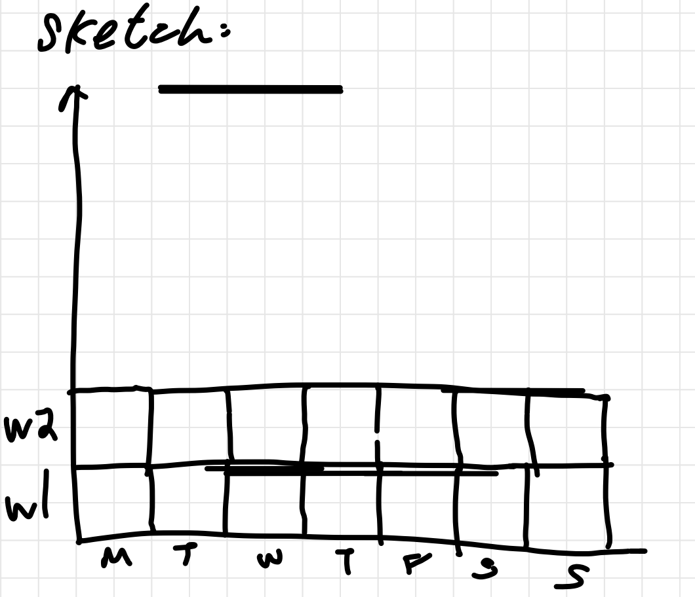
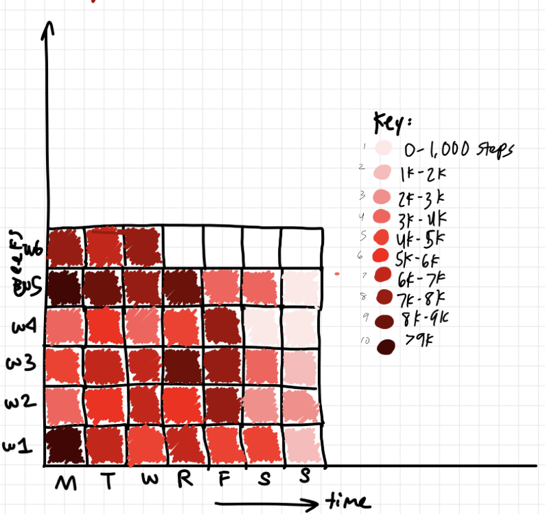
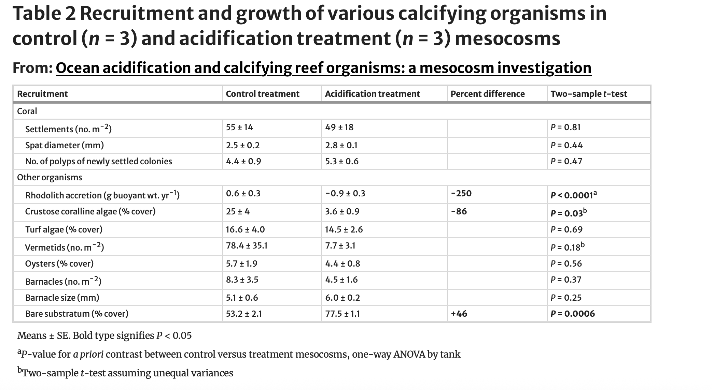

[link to homework 3 GitHub repository](https://github.com/valeriafierros/ENVS-193DS_homework-03)

[deployed html link](https://valeriafierros.github.io/ENVS-193DS_homework-03/code/envs193ds-homeowrk-03.html)

# 1. Set up

```{r}
#| label: set up

#reading in packages here
library(tidyverse)
library(here)
library(janitor)
library(readxl)

#reading in data here and making new object
salinity <- read_csv("../data/salinity-pickleweed.csv")
steps <- read_csv("../data/personaldata-updated.csv")

```


# 2. Problems

## Problem 1. Sough soil salinity

-   electrical conductivity (mS/cm)

### a.  An appropriate test

<!-- -->

1.  simple linear regression (linear model --\> lm())

-   describes a linear relationship between response (California pickleweed biomass) and predictor variables (salinity).

2.  Pearson's correlation

-   measures the strength and direction of a linear association (r)

The simple linear regression will tell us how salinity affects or predicts plant biomass, whereas the Pearson's correlation will tell us exactly *how* plant biomass and salinity are associated with one another.

### b. Creating a visualization

```{r}
#| label: salinity and biomass plot

#base layer: ggplot
ggplot(data = salinity,
       aes (x = salinity_mS_cm,
            y = pickleweed)) +
  #adding points and making them forest green
  geom_point(color = "forestgreen") +
  #adding a trendline
  geom_smooth(method = "lm",
              se = FALSE)+
  #adding labels and title
  labs(title = "As soil salinity (mS/cm) increases, California pickleweed biomass also \n increases.",
       x = "Soil Salinity (mS/cm)",
       y = "California Pickleweed Biomass (g)")+
  #changing default theme
  theme_light()


```

### c. Checking assumptions + running test (pearson correlation)

##### check your assumptions
```{r}
#| label: checking visual assumptions with scatterplot (linearity)

#base layer: ggplot
ggplot(data = salinity,
       aes (x = salinity_mS_cm,
            y = pickleweed)) +
  #adding points and making them forest green
  geom_point(color = "forestgreen") +
  #adding a trendline
  geom_smooth(method = "lm",
              se = FALSE)+
  #adding labels and title
  labs(title = "As soil salinity (mS/cm) increases, California pickleweed biomass also \n increases.",
       x = "Soil Salinity (mS/cm)",
       y = "California Pickleweed Biomass (g)")+
  #changing default theme
  theme_light()


```

```{r}
#| label: checking normality w qqplot and residuals
#| fig-height: 6
#| fig-width: 8

#making a model for qqplot 
salinity_model <- lm(pickleweed ~ salinity_mS_cm,
                     data = salinity)

#plotting salinity model to check QQplot with 2 x 2 plot
par(mfrow = c(2,2))
plot(salinity_model)
```

I checked the assumptions of linearity and normality of residuals (and assumed that the data is independent). The linearity assumption was evaluated using a scatterplot, and the normality of the data was evaluated using a QQplot. Based on these plots, we can conclude that the data is approximately linear (not many points in the scatterplot, but they are monotonic) and normal (no significant outliers or deviations in the qqplot). Therefore, we can say that the assumptions are reasonably met. 

##### run your test
```{r}

#running pearson's correlation --> describes the strength of the relationship between salinity and biomass with directionality
cor.test(salinity$pickleweed, salinity$salinity_mS_cm,
         method = "pearson") 

```

### d. results communication
To evaluate the strength of the relationship between California pickleweed biomass and soil salinity, I ran a Pearson's correlation because both variables are continuous, and this test measures the strength and direction of a linear relationship between two continuous variables. The results of the Pearson's correlation test indicate that there is a moderate, positive linear relationship between salinity (mS/cm) and California pickleweed biomass. The correlation coefficient (r = 0.534) indicates a moderate positive correlation, meaning that pickleweed biomass tends to increase as salinity increases. The p-value ( p = 0.0086) is less than 0.05, so the relationship is statistically significant, and we can reject the null hypothesis that the true correlation is 0 (or that there is no correlation) (Pearson's correlation, r = 0.53, t(21) = 2.90, p = 0.0086). 

### e. test implications
The results of our test suggest that pickleweed biomass increases as soil salinity increases, indicating that pickleweed performs better in more saline conditions. This means that planting efforts are more likely to be successful in areas of the restoration site with higher salinity, where pickleweed is better adapted to grow and accumulate biomass. Therefore, restoration efforts should focus on prioritizing planting pickleweed in more saline parts of the site to improve chances of success. 


### f. double checking my work

```{r}
#| label: linear regression

#running salinity model (already created in part 1c when checking assumptions)

salinity_model <- lm(pickleweed ~ salinity_mS_cm,
                     data = salinity)

#showing summary of salinity model                    
summary(salinity_model)

```
Both the Pearson's correlation and linear regression would lead to the same decision about the null hypothesis because they are testing the same underlying linear relationship between soil salinity and pickleweed biomass. In both tests, the p-value is significant, so we reject the null hypothesis (that there is no relationship between the predictor and response variables). Pearson's correlation decribes the strength and relationship (moderate, positive) while the linear regression additionally estimates the slope showing exactly how pickleweed biomass changes with increasing salinity.


## Problem 2. Personal data

### a. updating my visualizations

```{r}
steps <- steps |> #calling in dataframe
  mutate(`day of week` = factor(`day of week`,#modifying the day of week column and converting day of week into a factor (categorical variable)
                                levels = c("M", "T", "W", "Th", "F", "Sa", "Su"), #specify levels
                                ordered = TRUE)) #keep in order
ggplot(steps, #calling in ggplot visualization and specifying dataset
       aes(x = `day of week`, #make x axis
           y = `steps taken`, #make y axis
           fill = `day of week`))+ #fill in bar colors by day of the week
  stat_summary(fun = mean, #using the mean to summarize the y values
               geom = "bar")+ #making a bar chart
  labs(title = "Daily Step Count By Day of Week", #titling the graph
       x = "Day of Week", #labelling x axis
       y = "Steps Taken")+ #labelling y axis
  scale_fill_manual(values = c( #manually setting colors for each day of the week
    "M" = "red", #monday = red
    "T" = "orange", # tuesday = orange
    "W" = "yellow", #wednesday = yellow
    "Th" = "green", #thursday = green
    "F" = "blue", #friday = blue
    "Sa" = "violet", # saturday = purple
    "Su" = "hotpink" #sunday = pink
  ),
  drop = FALSE)+ #keep all the factors (days) in even if they have no data yet
  theme_minimal()+ #changin theme from the default
  theme(legend.position = "none") #removing legend


```

```{r}
steps <- steps |> #calling in data frame
  mutate(date = as.Date(date, format = "%m/%d")) #change date to month/day format

ggplot(steps, #calling in data frame
       aes(x = date, #setting x axis
           y = `steps taken`))+ #setting y axis
  geom_point(color = "lightpink", #point colors are light pink
             size = 3, #point size
             alpha = 0.7)+ #point transparency
  geom_smooth(method = "lm", #adding a trendline (linear)
              color = "hotpink", #hot pink line
              se = FALSE)+  #removes error lines
  labs(title = "Daily Step Count Over 1 month", #graph title
       x = "Date", #x axis label
       y = "Steps Taken")+ #y axis label
  theme_light() #changing theme from the default


```


### b. captions

**Figure 1. Step count varies by day of the week.** Bar graph visualization indicating step count by day of the week (Monday - red, Tuesday - orange, Wednesday - yellow, Thursday - green, Friday - blue, Saturday - purple, Sunday - pink). Shows how step count varies by weekday versus weekend. 

**Figure 2. Step count has decreased over time.** Scatterplot visualization with continuous (date) predictor and response variable (steps). Points represent individual daily step counts and trendline shows average pattern over 1 month. 


## Problem 3. Affective visualization

### a. personal data visualization
I think that an effective affective visualization could be a heatmap of daily step counts with 7 rows, which I could either make digitally or with yarn as a crochet scarf type of physical medium. Every day would be represented by a certain shade of a color to show the step count, and the step counts could be broken up into categories (0-500, 500-1000, etc.) This visualization would allow us to quickly see patterns in activity across time, like differences between weekdays and weekends or streaks of higher activity, while also conveying the rythym of daily movement over the time period. 

### b. sketch


### c. draft of visualization



### d. artist statement
- content of piece: 
  My project is going to represent the relationship between the day of the week and the number of steps I take in a day. I'm creating a heat map using a gradient of colors that correspond to ranges of step counts (0-1000, 1000-2000, etc.), allowing for us to see any patterns in activity levels across weekdays and weekends over time. 

- influences: 
  I was inspired by scientific heat maps that are often used to visualize important environmental data, such as rising global temperatures or atmospheric CO₂ levels. I think that these visualizations are both visually striking and effective at communicating patterns in data, so I wanted to apply a similar concept even though my data is not as valuable. 
  
- form of the work: 
  The final piece will take the form of a crocheted textile made up of a bunch of smaller squares. Each square is going to represent a day and will be colored according to its step-count category for that day. 
  
- process: 
  To create this, I will individual squares corresponding to each day in my dataset using yarn colors that represent different step ranges (right now I have it as a gradient, but this may change depending yarn availability). After, I'll assemble the squares in order into a larger sheet/tapestry type-thing that visually resembles a heat map. 

### e. slides for workshop
[workshop-week 9 slides](https://docs.google.com/presentation/d/1RVhm2DgvGjEUGyMO99HyHclAD-wtaLrD6JKy1wb01kQ/edit?slide=id.p#slide=id.p)

## Problem 4. statistical critique

### a. revisit and summarize
A two-sample t-test was used in this paper to compare the total number of recruits for each replicate of treatment versus control mesocosms of coral reefs. The response variable is the calcification rate of the reefs while the predictor variable is the amount of partial pressure of carbon dioxide present. They also used a t-test to compare the calcification rate of individual settlements of other calcifying organism populations. The response variable is still calcification rate and the predictor is still partial pressure of carbon dioxide.



### b. visual clarity - How clearly does the table represent the data underlying tests?
I think that the table accurately represents all of the data talked about in the paper, and it is fairly clear in its results. It shows the values of the control and acid treatments, and then also includes the p-values from the two-sample t-tests, which is the statistical test I chose to focus on from the paper. It does not, however, include any additional information about the test (besides the sample size in the caption), so adding other information may help us understand better if we were to just read the table and not the paper also.


### c. aesthetic clarity - How well did the authors handle “visual clutter”? Is there any bolding/italic text to draw your eye to specific numbers?

I think that the table is not very visually cluttered, even though it does include a lot of information. They bolded their significant p-values in the table, so that helps us see which experiments/organisms were found to be affected by the treatment. Overall, the table is neat, organized, and easy to read. 


### d. recommendations
If I were to make any recommendations for this table, I would suggest adding a caption for the table to explain some of the information included. They bold "percent difference," but don't include a description of what it is describing (in the paper either), so I would maybe be more specific in that aspect. Besides that, they are fairly clear in all aspects of the table and also include footnotes for their superscripts, so that would be the only addition I would like to recommend. 


